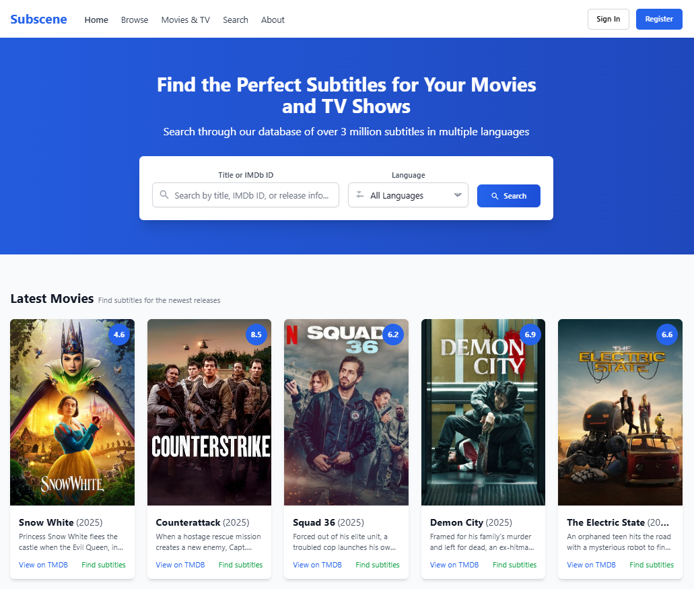

# Subscene - Subtitle Sharing Platform

[](https://nextjs.org/)
[](https://reactjs.org/)
[](https://nodejs.org/)
[](https://www.postgresql.org/)
[](https://tailwindcss.com/)
[](https://opensource.org/licenses/MIT)

A modern Next.js application for browsing, searching, and uploading subtitles with TMDB integration and user authentication. This project provides a platform similar to Subscene where users can find and share subtitles for movies and TV shows.

## 📸 Screenshots



## 🌟 Features

- **User Authentication**: Register, login, and user account management
- **Search for Subtitles**: Powerful search with filters for language and other criteria
- **Browse Subtitles**: Browse the latest uploaded subtitles
- **Subtitle Details**: View subtitle information with download capability
- **Upload Subtitles**: Registered users can upload subtitle files
- **TMDB Integration**: Movie and TV show information from The Movie Database
- **Modal Authentication**: Login and registration without page redirects
- **Responsive Design**: Mobile-friendly interface

## 🚀 Tech Stack

- **Frontend**: Next.js 15.x, React 19.x, Tailwind CSS 3.x
- **Forms**: Formik with Yup validation
- **Backend**: Next.js API Routes
- **Database**: PostgreSQL
- **Authentication**: JWT, HTTP-only cookies
- **Media Data**: TMDB API integration

## 📋 Prerequisites

- Node.js 18.18.0 or higher
- PostgreSQL 12.x or higher
- NPM or Yarn package manager

## 💻 Installation

1. **Clone the repository**

```bash
git clone https://github.com/wasishah33/Subscene-Clone.git
cd Subscene-Clone
```

2. **Install dependencies**

```bash
npm install
# or
yarn
```

3. **Set up environment variables**

Create a `.env.local` file in the root of the project based on `.env.example`:

```bash
cp .env.example .env.local
# Now edit .env.local with your actual configuration
```

4. **Run the development server**

```bash
npm run dev
# or
yarn dev
```

5. **Access the application**

Open [http://localhost:3000](http://localhost:3000) in your browser.

## 🗃️ Database Setup

The application will automatically create the necessary tables when it starts:

- `users`: Stores user account information
- `uploads`: Stores uploaded subtitles
- `all_subs`: Stores existing subtitles data

If you need to manually set up the database:

```sql
CREATE DATABASE subscene;
```

Then make sure your connection string in `.env.local` points to this database.

## 🔒 Authentication System

- JWT-based authentication with HTTP-only cookies
- Secure password hashing with bcrypt
- Modal-based login/register UI for better user experience
- Protected API routes for authorized users

## 🌐 API Endpoints

- `/api/auth/*` - Authentication endpoints (register, login, user)
- `/api/subtitles/*` - Subtitle search and management
- `/api/uploads/*` - Upload management
- `/api/tmdb-proxy` - TMDB API proxy

## 📦 Building for Production

```bash
npm run build
npm start
# or
yarn build
yarn start
```

## 🧪 Contributing

Contributions are welcome! Please feel free to submit a Pull Request.

1. Fork the repository
2. Create your feature branch (`git checkout -b feature/amazing-feature`)
3. Commit your changes (`git commit -m 'Add some amazing feature'`)
4. Push to the branch (`git push origin feature/amazing-feature`)
5. Open a Pull Request

## 📄 License

This project is licensed under the MIT License - see the [LICENSE](LICENSE) file for details.

## 🙏 Acknowledgments

- [The Movie Database (TMDB)](https://www.themoviedb.org/) for the movie and TV show data
- [Tailwind CSS](https://tailwindcss.com/) for the UI framework
- All the open-source libraries used in this project 